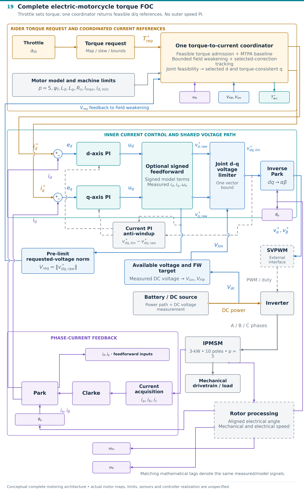

# PMSM Closed-Loop Control

Field-oriented control documentation for a **3-kW electric-motorcycle drive** using a **ten-pole IPMSM** ($`p=5`$). The rider commands torque through the throttle. Closed d- and q-axis current loops regulate the selected current references, while measured rotor speed supplies the operating point for reference generation and compensation.

**[Read the complete FOC development report](docs/FOC_REPORT.md)**

## Project at a glance

| Item | Control architecture |
|---|---|
| Application | Electric-motorcycle torque control |
| Machine | IPMSM; 10 poles / 5 pole pairs |
| Rider input | Throttle-derived torque request |
| Current references | Coordinated MTPA, field weakening and joint feasibility |
| Electrical feedback | Three acquired phase currents transformed into dq |
| Current controllers | Separate d- and q-axis PI channels |
| Voltage handling | Shared dq voltage limit and matching PI anti-windup feedback |
| Rotor signals | Aligned electrical angle and mechanical/electrical speed |
| Modulation interface | Stationary-frame voltage references to external SVPWM |
| Development workflow | MATLAB/Simulink; intended embedded-microcontroller target |

## Complete motorcycle control architecture

The reference coordinator admits feasible torque and supplies both current references. The requested dq voltage is measured **before** the shared limiter for field-weakening feedback. The limited-minus-requested voltage residual returns to the matching current PI states. Rotor angle reaches both coordinate transforms; three-phase current feedback closes the electrical loops.

The motorcycle architecture uses torque demand without an outer speed PI. With MTPA active, the d-current baseline can already be negative below field weakening; releasing field weakening returns to that baseline. The zero-d case is a simplified example, rather than a general IPMSM MTPA rule.

## Report guide

| Topic | Open the report section |
|---|---|
| Drive equipment and motor | [Section 1](docs/FOC_REPORT.md#1-drive-equipment-and-motor) |
| Coordinates, Clarke/Park and animated examples | [Section 2](docs/FOC_REPORT.md#2-electrical-coordinates-and-transformations) |
| IPMSM flux, voltage and torque model | [Section 3](docs/FOC_REPORT.md#3-ipmsm-model-behind-the-current-loops) |
| Current PI loops and optional feedforward | [Section 4](docs/FOC_REPORT.md#4-how-the-current-loops-close) |
| Throttle torque and coordinated references | [Section 5](docs/FOC_REPORT.md#5-torque-demand-and-current-references) |
| Current and voltage constraints | [Section 6](docs/FOC_REPORT.md#6-current-and-voltage-command-limits) |
| Field weakening and MTPA | [Section 7](docs/FOC_REPORT.md#7-field-weakening-and-mtpa) |
| Rotor/SVPWM interfaces and Simulink structure | [Section 8](docs/FOC_REPORT.md#8-interfaces-and-simulink-structure) |
| Complete motorcycle torque-control structure | [Section 9](docs/FOC_REPORT.md#9-complete-electric-motorcycle-torque-foc) |
| Mathematical documentation | [References](docs/FOC_REPORT.md#mathematical-references) |

## Engineering scope

The report contains **19 technical figures, 36 display equations and 3 animated illustrations**. It explains the control relationships, coordinate conventions, constraint handling and functional interfaces. Illustrative geometry is identified in the relevant captions. Motor-model parameters, gains, calibration and reference maps require project-specific definition; test and performance results are documented separately.
