# FOC Development Report — 3-kW IPMSM Electric Motorcycle Drive

> **Development note:** The 3-kW IPMSM motorcycle has 10 poles, p = 5, and uses throttle-derived torque demand with no speed-control loop. A coordinated MTPA/field-weakening reference generator supplies $`i_{d}^{\ast}`$ and $`i_{q}^{\ast}`$. The actual model, remaining motor parameters, maps, gains, limits, and calibration were not supplied; the diagrams explain the control relationships. Test and performance results are documented separately.

The software is developed in MATLAB/Simulink for embedded microcontroller implementation. Rotor processing supplies the FOC angle/speed interface; external SVPWM receives the stationary-frame voltage commands.

## Contents

- [1. Drive equipment and motor](#1-drive-equipment-and-motor)
- [2. Electrical coordinates and transformations](#2-electrical-coordinates-and-transformations)
- [3. IPMSM model behind the current loops](#3-ipmsm-model-behind-the-current-loops)
- [4. How the current loops close](#4-how-the-current-loops-close)
- [5. Torque demand and current references](#5-torque-demand-and-current-references)
- [6. Current and voltage command limits](#6-current-and-voltage-command-limits)
- [7. Field weakening and MTPA](#7-field-weakening-and-mtpa)
- [8. Interfaces and Simulink structure](#8-interfaces-and-simulink-structure)
- [9. Complete electric-motorcycle torque FOC](#9-complete-electric-motorcycle-torque-foc)
- [Mathematical references](#mathematical-references)

## 1. Drive equipment and motor

The inverter converts DC power into phase excitation; electromagnetic torque drives the shaft and load. With $`T_{\mathrm{shaft}}`$ denoting delivered shaft torque, mechanical output power follows:

```math
P_{\mathrm{shaft}}=T_{\mathrm{shaft}}\omega_{m}
```

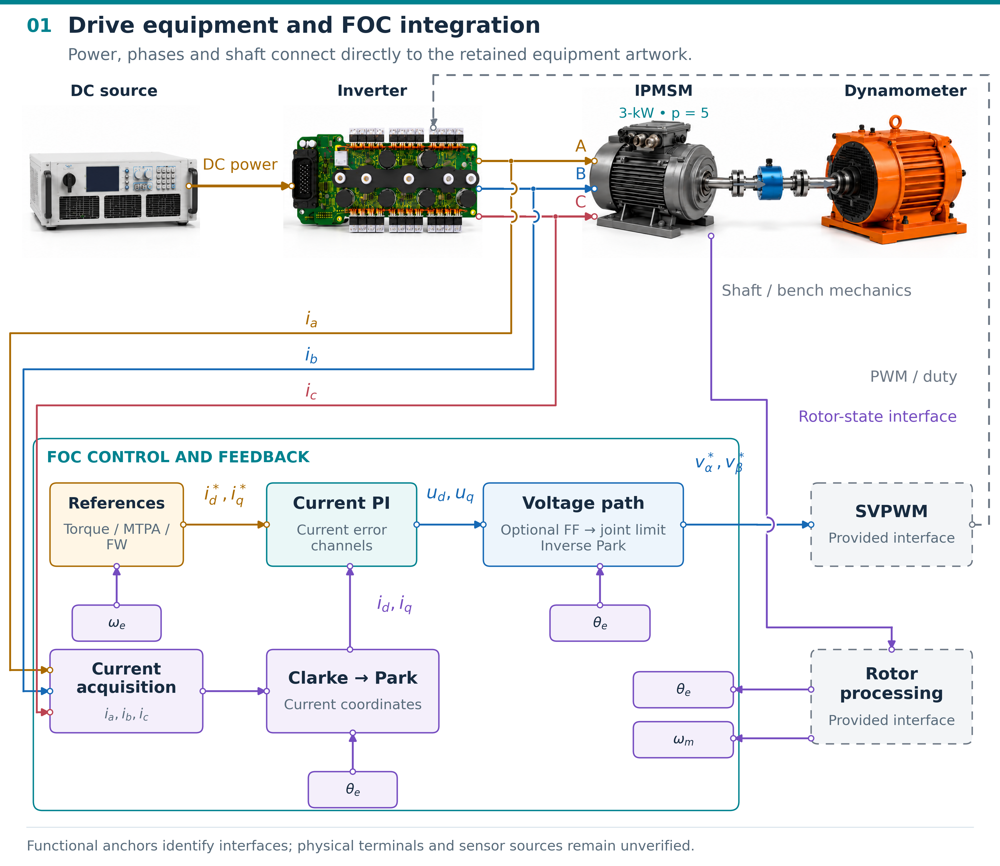

**Figure 1.** Functional DC, A/B/C phase, and shaft connections are drawn directly on the equipment artwork. Three separate measured phase-current branches reach current acquisition; the rotor interface returns angle/speed information to FOC. The artwork is representative; the actual current-sensor implementation, equipment terminals, and rotor-position source are unspecified.

| Project input | Value |
|---|---|
| Application | 3-kW IPMSM electric motorcycle drive |
| Motor | 10 poles; p = 5 pole pairs |
| Development environment | MATLAB/Simulink |
| Intended target | Embedded microcontroller |

## 2. Electrical coordinates and transformations

### 2.1 Motor axes and electrical angle

The d-axis follows PM flux; q leads d by 90 electrical degrees. For raw mechanical angle, the five pole pairs multiply the angle and speed. Direction sign s = ±1 and electrical alignment offset $`\theta_{0}`$ complete the conversion:

```math
\theta_{e}=\mathrm{wrap}(s\,5\theta_{m}+\theta_{0}),\qquad
\omega_{e}=s\,5\omega_{m}
```

With matched direction and zero offset, $`\theta_{e}`$ = 5θ_m and $`\omega_{e}`$ = 5ω_m: one mechanical revolution spans five electrical revolutions. An already aligned electrical-angle input passes directly to the transforms.

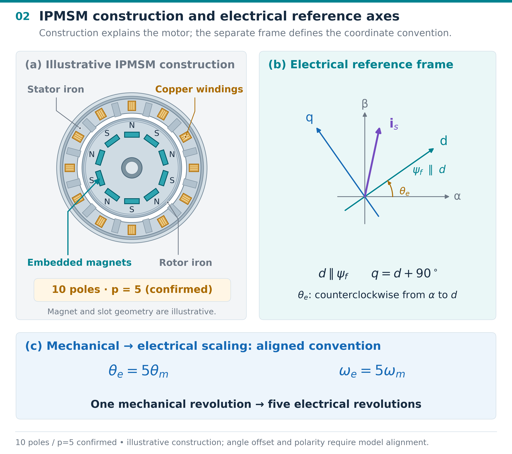

**Figure 2.** Illustrative ten-pole construction, electrical reference axes, and aligned 5× scaling occupy separate panels. The magnet leader identifies an embedded magnet. Slot/magnet geometry is illustrative; the confirmed project input is 10 poles, p = 5.

### 2.2 One vector, two coordinate descriptions

Changing the frame changes the components while preserving the physical vector and its norm:

```math
\mathbf i_{s}=i_{\alpha}\hat{\mathbf e}_{\alpha}+i_{\beta}\hat{\mathbf e}_{\beta}
=i_{d}\hat{\mathbf e}_{d}+i_{q}\hat{\mathbf e}_{q},\qquad
i_{\alpha}^{2}+i_{\beta}^{2}=i_{d}^{2}+i_{q}^{2}
```

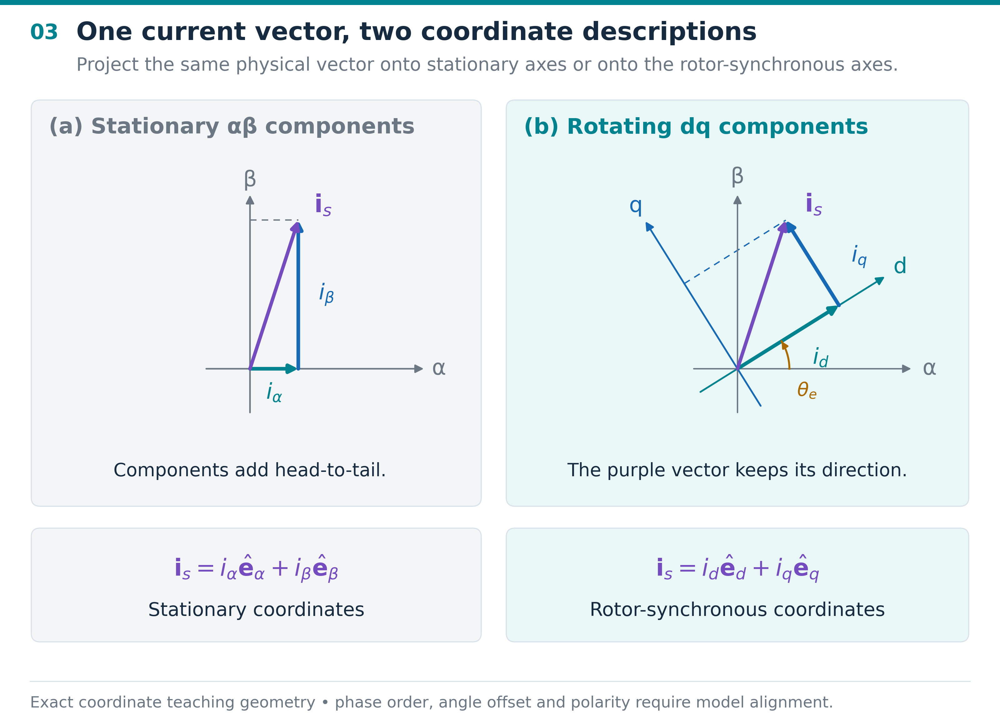

**Figure 3.** The same purple current vector appears in both panels. Stationary αβ components and rotating dq components each add head-to-tail to reconstruct it.

| Convention | Definition |
|---|---|
| Clarke scaling | Amplitude-invariant 2/3; zero-sequence excluded |
| Axis orientation | α follows phase a; β leads α by +90°; q leads d by +90° |
| Electrical angle | $`\theta_{e}`$ is counterclockwise from α to d |
| References | Superscript * denotes a command/reference |
| Amplitudes | dq current/voltage amplitudes correspond to balanced phase peak |

### 2.3 Clarke: phase currents to stationary components

The weighted phase contributions produce the stationary current vector:

```math
\begin{bmatrix}i_{\alpha}\\i_{\beta}\end{bmatrix}
=\frac{2}{3}
\begin{bmatrix}1&-\tfrac12&-\tfrac12\\0&\tfrac{\sqrt3}{2}&-\tfrac{\sqrt3}{2}\end{bmatrix}
\begin{bmatrix}i_{a}\\i_{b}\\i_{c}\end{bmatrix}
```

When $`i_{a}`$ + $`i_{b}`$ + $`i_{c}`$ = 0, this reduces to $`i_{\alpha}`$ = $`i_{a}`$ and $`i_{\beta}`$ = ($`i_{a}`$ + 2i_b)/√3. That shorter form depends on the zero-sum condition.

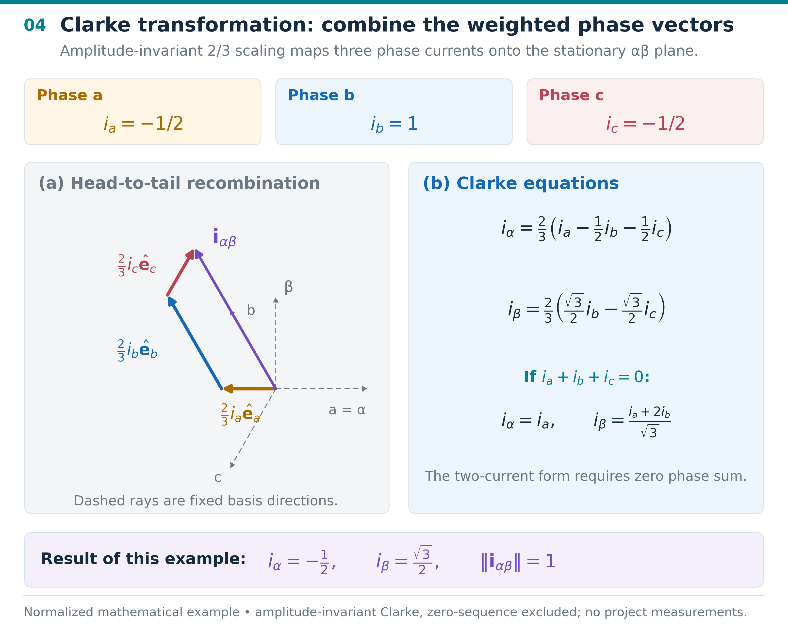

**Figure 4.** The normalized phase contributions add head-to-tail; the Clarke equations give the resulting αβ components. The reduced two-current equations are shown with their zero-phase-sum condition.

### 2.4 Park and inverse Park

Park rotates current coordinates into the rotor frame. Inverse Park rotates the commanded voltage back into the stationary frame using the same $`\theta_{e}`$:

```math
\begin{bmatrix}i_{d}\\i_{q}\end{bmatrix}
=\begin{bmatrix}\cos\theta_{e}&\sin\theta_{e}\\-\sin\theta_{e}&\cos\theta_{e}\end{bmatrix}
\begin{bmatrix}i_{\alpha}\\i_{\beta}\end{bmatrix},\qquad
\begin{bmatrix}v_{\alpha}^{\ast}\\v_{\beta}^{\ast}\end{bmatrix}
=\begin{bmatrix}\cos\theta_{e}&-\sin\theta_{e}\\\sin\theta_{e}&\cos\theta_{e}\end{bmatrix}
\begin{bmatrix}v_{d}^{\ast}\\v_{q}^{\ast}\end{bmatrix}
```

Both rotations preserve vector magnitude. This connects rotor-frame current feedback to stationary-frame inverter commands.

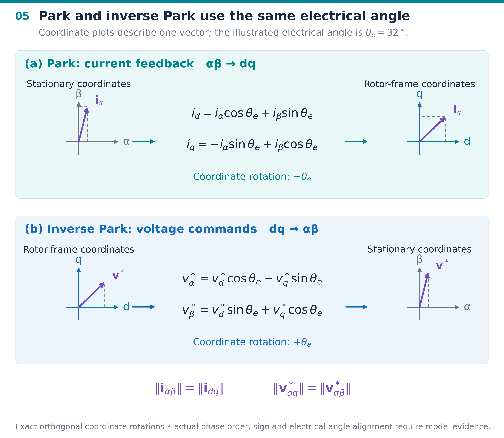

**Figure 5.** Separate panels show current-feedback Park, αβ → dq, and voltage-command inverse Park, dq → αβ. The physical vector and norm remain unchanged.

### 2.5 Why sinusoidal currents become steady dq components

For an ideal balanced pure-q example with amplitude I and synchronous $`\theta_{e}`$:

```math
i_{a}=I\cos(\theta_{e}+\tfrac{\pi}{2}),\qquad
i_{\alpha}=-I\sin\theta_{e},\qquad i_{\beta}=I\cos\theta_{e}
\quad\Longrightarrow\quad i_{d}=0,\quad i_{q}=I
```

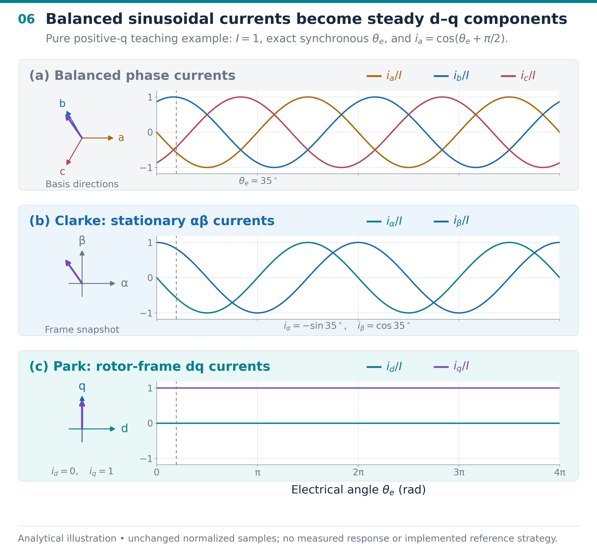

**Figure 6.** Aligned analytical waveforms show I = 1, $`i_{d}`$ = 0, and $`i_{q}`$ = 1. The 35° marker connects the waveforms to their frame snapshots.

### Animated example A1 — Synchronous current transformation

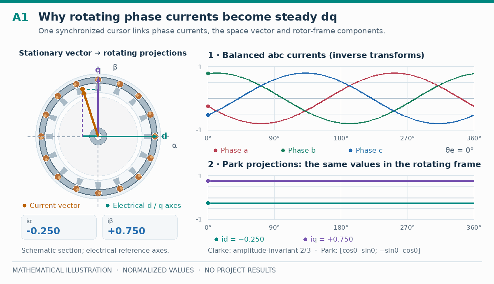

The same balanced current vector becomes constant $`i_{d}`$ and $`i_{q}`$ when the Park angle rotates synchronously. This normalized illustration follows one electrical cycle. For the confirmed five pole pairs, one aligned mechanical revolution spans five electrical revolutions. The values illustrate geometry rather than measured motor response.

### Animated example A2 — Electrical-angle alignment

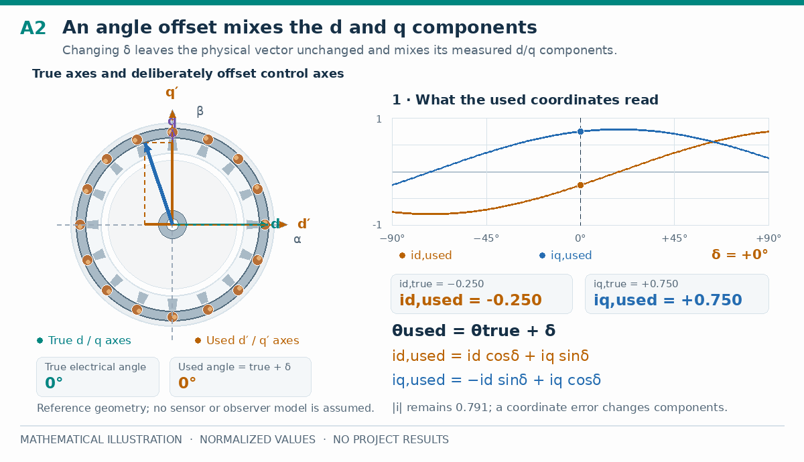

An angle offset rotates the measurement frame and mixes its d- and q-components without changing the physical current vector. At a fixed offset, the measured dq components remain constant. This analytical illustration does not model an observer, sensor or closed-loop drive response.

Animation A1 explores the same geometry with mixed d/q components. A2 varies angle alignment while retaining the physical current vector. Both use electrical angle; for p = 5, five electrical revolutions correspond to one mechanical revolution under aligned rotation.

## 3. IPMSM model behind the current loops

The linear-parameter synchronous model links current to flux:

```math
\psi_{d}=L_{d}i_{d}+\psi_{f},\qquad\psi_{q}=L_{q}i_{q}
```

The applied voltages must supply resistance, current dynamics, and speed-dependent terms:

```math
v_{d}=R_{s}i_{d}+L_{d}\frac{di_{d}}{dt}-\omega_{e}L_{q}i_{q}
```

```math
v_{q}=R_{s}i_{q}+L_{q}\frac{di_{q}}{dt}+\omega_{e}(L_{d}i_{d}+\psi_{f})
```

Torque combines PM and saliency contributions; mechanical acceleration follows the torque balance:

```math
T_{e}=\underbrace{\frac32p\psi_{f}i_{q}}_{T_{PM}}
+\underbrace{\frac32p(L_{d}-L_{q})i_{d}i_{q}}_{T_{rel}},\qquad p=5
```

```math
J\frac{d\omega_{m}}{dt}=T_{e}-T_{L}-B\omega_{m}
```

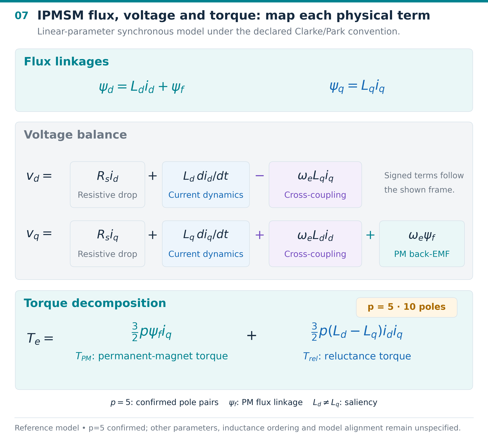

**Figure 7.** Flux linkages, signed voltage terms, and torque components are separated. The q-axis speed terms distinguish cross-coupling from PM back-EMF. p = 5 is confirmed; $`R_{s}`$, $`L_{d}`$, $`L_{q}`$, $`\psi_{f}`$, J, B, and the inductance ordering are unspecified.

## 4. How the current loops close

### 4.1 Overall control architecture

Each current controller compares a reference with the corresponding measured component. Its PI output is a voltage request:

```math
\begin{aligned}
e_{d}&=i_{d}^{\ast}-i_{d},&
u_{d}&=K_{pd}e_{d}+K_{id}\int e_{d}\,dt\\
e_{q}&=i_{q}^{\ast}-i_{q},&
u_{q}&=K_{pq}e_{q}+K_{iq}\int e_{q}\,dt
\end{aligned}
```

The motorcycle's throttle interface requests electrical motor torque. One coordinated reference function uses the torque request, electrical speed, available voltage, and machine bounds:

```math
\begin{aligned}
T_{\mathrm{req}}^{\ast}&=f_{\mathrm{throttle}}(a_{\mathrm{th}},\text{vehicle state})\\
(i_{d}^{\ast},i_{q}^{\ast},T_{\mathrm{acc}}^{\ast})&=
\mathcal R(T_{\mathrm{req}}^{\ast},\omega_{e},V_{\mathrm{dc}},V_{\mathrm{req}},\text{model and bounds})
\end{aligned}
```

$`T_{\mathrm{acc}}^{\ast}`$ is the feasible accepted electromagnetic torque; it can be lower than the rider request. The function R groups MTPA, voltage-feedback field weakening, and joint feasibility. It returns both current references. The two complete voltage requests share one vector limiter and inverse Park. Phase-current feedback returns through Clarke/Park as $`i_{d}`$ and $`i_{q}`$; $`\theta_{e}`$ aligns both transforms. Electrical speed feeds operating-point calculations and optional compensation. There is no speed setpoint or speed PI.

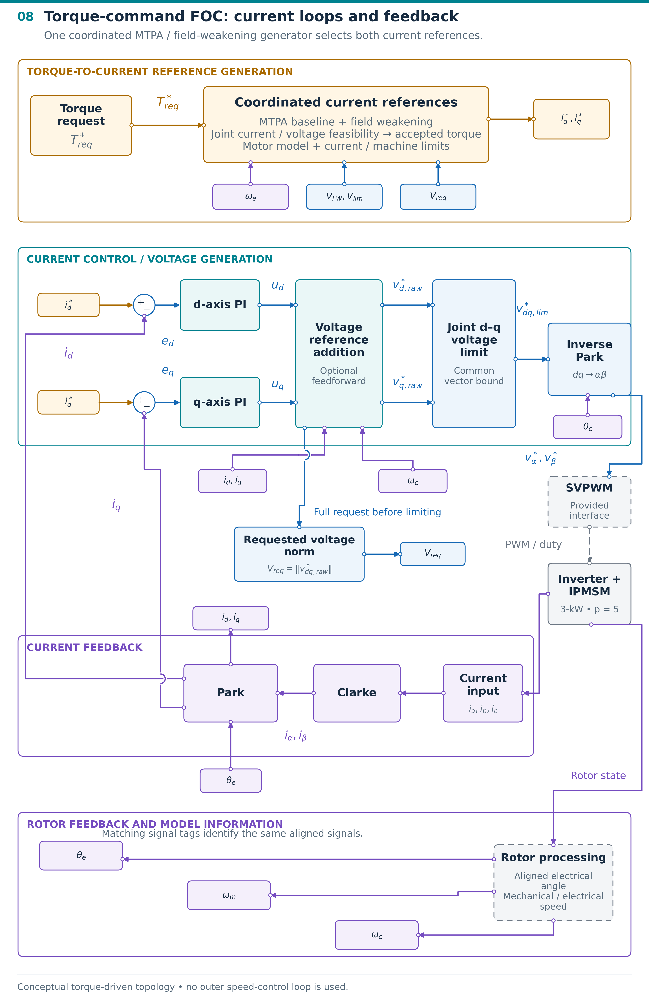

**Figure 8.** Torque demand enters one coordinated current-reference block; its outputs feed the matching d/q current errors. The separated lower feedback paths distinguish measured currents, electrical angle, electrical speed, and available voltage. One shared dq limiter precedes inverse Park and external SVPWM.

### 4.2 d-axis loop

Rearranging the motor equation shows how d-voltage controls d-current. The reference-minus-feedback error gives the required negative-feedback connection:

```math
\begin{aligned}
L_{d}\frac{di_{d}}{dt}+R_{s}i_{d}&=v_{d}+\omega_{e}L_{q}i_{q}\\
e_{d}=i_{d}^{\ast}-i_{d},\qquad
u_{d}&=K_{pd}e_{d}+K_{id}\int e_{d}\,dt
\end{aligned}
```

If $`i_{d}`$ is below its reference, $`e_{d}`$ is positive and the PI requests a higher d-voltage under this sign convention.


**Figure 9.** Measured $`i_{d}`$ returns to the negative d-error input. The companion q-voltage joins the same limiter and two-axis actuator; acquisition and Clarke/Park close the current path.

### 4.3 q-axis loop

The q-voltage must also overcome the speed-dependent flux term:

```math
\begin{aligned}
L_{q}\frac{di_{q}}{dt}+R_{s}i_{q}&=v_{q}-\omega_{e}(L_{d}i_{d}+\psi_{f})\\
e_{q}=i_{q}^{\ast}-i_{q},\qquad
u_{q}&=K_{pq}e_{q}+K_{iq}\int e_{q}\,dt
\end{aligned}
```

The PI acts on q-current error; the plant's q-current response returns to the matching negative input.

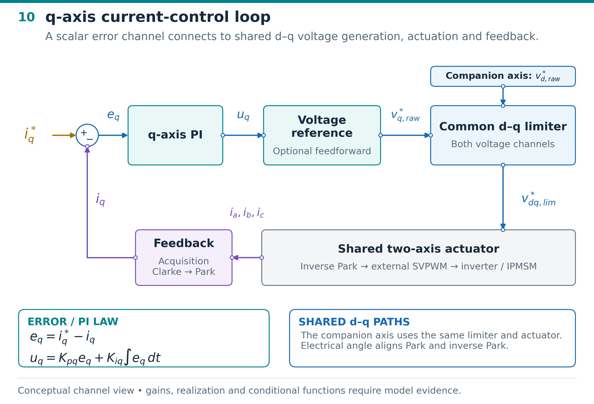

**Figure 10.** Measured $`i_{q}`$ closes the q-error channel. Both axes use the same voltage limiter, inverse Park, SVPWM, inverter, and motor.

### 4.4 Optional decoupling feedforward

For the stated model convention, complete signed feedforward terms are added to the PI outputs:

```math
v_{d,\mathrm{raw}}^{\ast}=u_{d}-\omega_{e}L_{q}i_{q},\qquad
v_{q,\mathrm{raw}}^{\ast}=u_{q}+\omega_{e}(L_{d}i_{d}+\psi_{f})
```

With exact parameters and no voltage saturation, substitution cancels the modeled speed terms:

```math
L_{d}\frac{di_{d}}{dt}+R_{s}i_{d}=u_{d},\qquad
L_{q}\frac{di_{q}}{dt}+R_{s}i_{q}=u_{q}
```

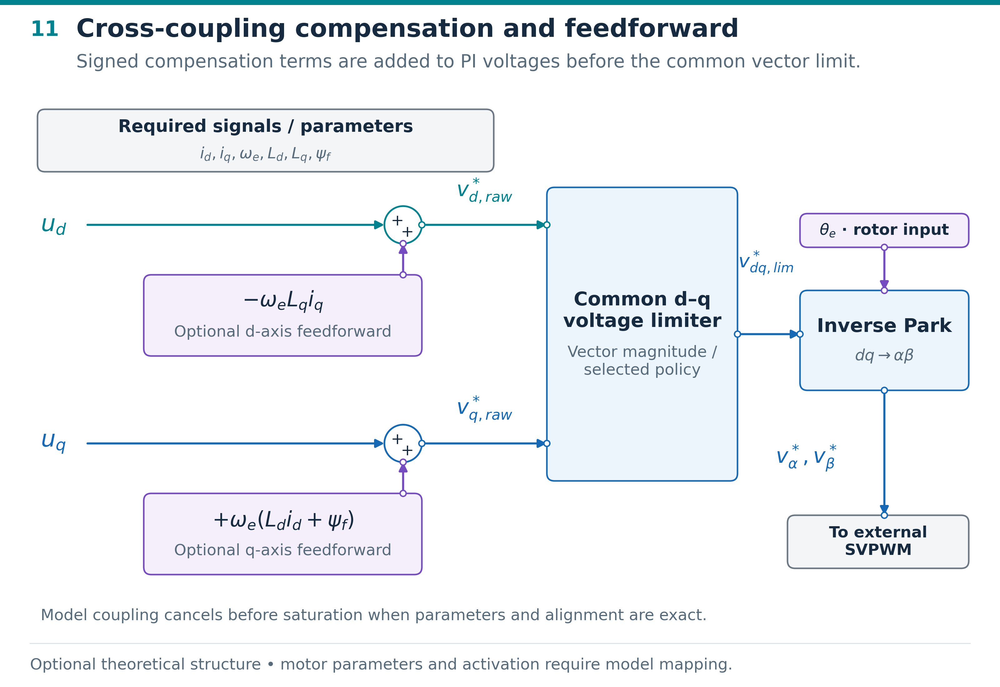

**Figure 11.** Negative d-axis coupling and positive q-axis coupling/back-EMF enter the voltage requests as complete signed terms. The common limiter acts on both requests before inverse Park. Feedforward is an optional structure.

## 5. Torque demand and current references

### 5.1 Throttle torque command and inner current loops

The torque interface receives the conditioned throttle request. Current tracking produces electromagnetic torque through the IPMSM model; mechanical speed follows the load dynamics:

```math
\begin{aligned}
T_{e}&=\frac32p\,i_{q}[\psi_{f}+(L_{d}-L_{q})i_{d}]\\
J\frac{d\omega_{m}}{dt}&=T_{e}-T_{L}-B\omega_{m},\qquad p=5
\end{aligned}
```

The requested torque is not a speed target. Measured speed remains useful for voltage feasibility and feedforward. The throttle map, conditioning and any wheel-to-motor torque conversion are unspecified. If the request is defined at the wheel, gearing and efficiency must be handled before this electrical motor-torque interface.

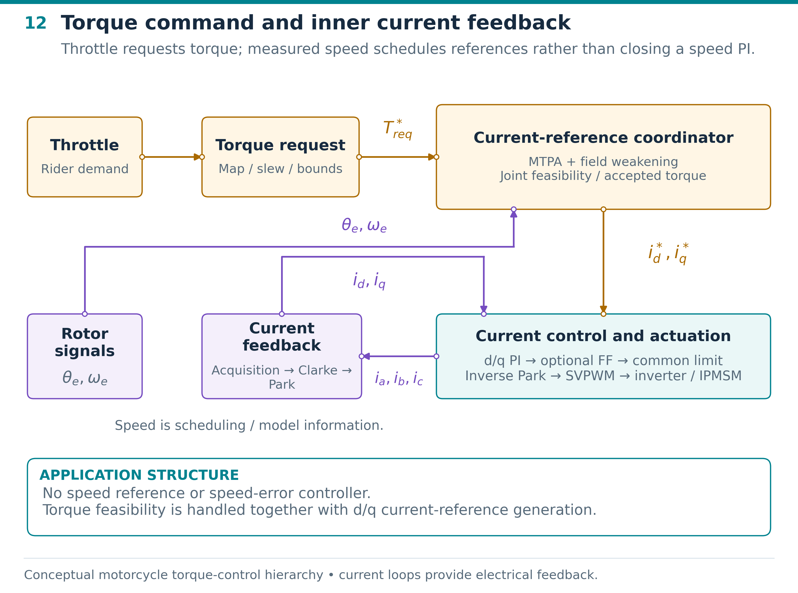

**Figure 12.** Throttle-derived torque reaches the reference coordinator; measured dq currents close the electrical loops. Motor/load dynamics determine speed, which feeds operating-point calculations rather than a speed-error controller.

### 5.2 Torque-consistent reference allocation

While voltage headroom is adequate, MTPA selects a minimum-current baseline for the accepted torque. Field weakening can change its d-component. The q-reference must then be recalculated for that selected d-current:

```math
\begin{aligned}
i_{d}^{\ast}&=i_{d,0}^{\ast}+\Delta i_{d,\mathrm{FW}},\qquad \Delta i_{d,\mathrm{FW}}\le0\\
i_{q}^{\ast}&=\frac{T_{\mathrm{acc}}^{\ast}}
{\frac32p[\psi_{f}+(L_{d}-L_{q})i_{d}^{\ast}]},\qquad p=5
\end{aligned}
```

This mapping assumes a positive torque coefficient bounded away from zero. The coordinator checks both current and voltage feasibility, plus machine bounds. If the pair cannot deliver the rider demand, it reduces $`T_{\mathrm{acc}}^{\ast}`$ and resolves the pair. An independent q-current clip would change torque and must be included in that accepted-torque calculation. Section 7 develops the MTPA and FW relationships.

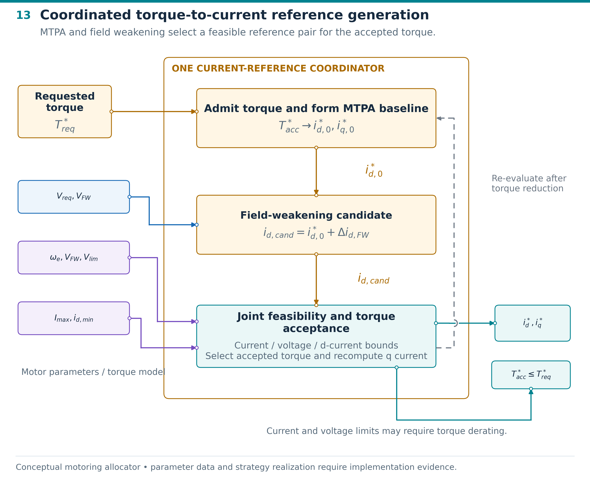

**Figure 13.** One torque-to-current coordinator combines MTPA, bounded FW correction, and joint feasible torque selection. Both selected current references correspond to $`T_{\mathrm{acc}}^{\ast}`$, which is identified explicitly when constraints reduce the request.

## 6. Current and voltage command limits

The current-reference circle and voltage-command circle constrain different vectors:

```math
\sqrt{(i_{d}^{\ast})^{2}+(i_{q}^{\ast})^{2}}\le I_{\max},\qquad
\sqrt{(v_{d}^{\ast})^{2}+(v_{q}^{\ast})^{2}}\le V_{\mathrm{lim}}
```

These amplitudes use balanced phase-peak scaling. $`V_{\mathrm{lim}}`$ depends on the DC link, modulation convention, and available margin. Animation A3 denotes its normalized illustrative bound by Vmax.

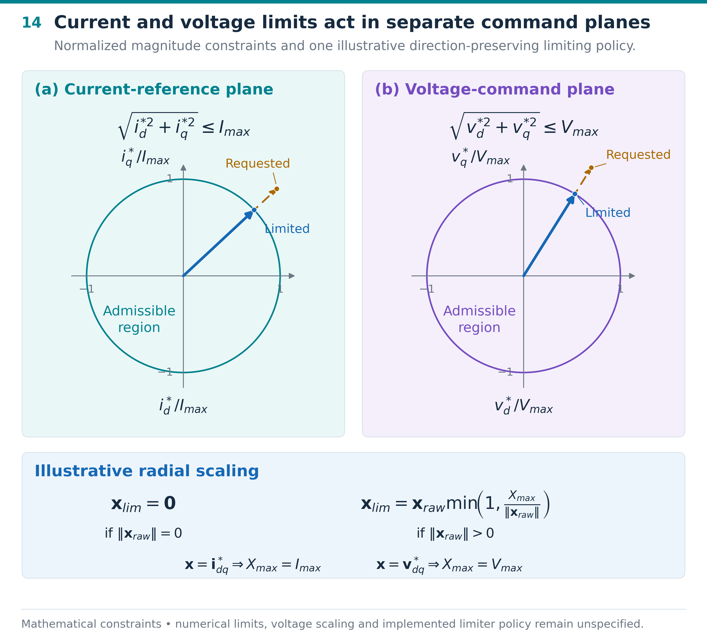

**Figure 14.** Separate normalized planes show current-reference and voltage-command constraints. Radial projection is an illustrative policy that preserves direction and maps a zero request to zero. The motorcycle coordinator instead selects a jointly feasible current pair for accepted torque; current-only projection is not a same-torque allocation. Animation A3 extends the voltage-command geometry.

### Animated example A3 — Shared voltage-vector limitation

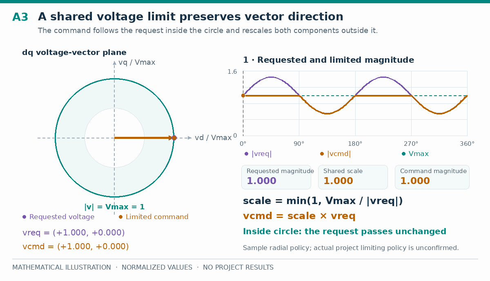

A sample radial rescaling limits command magnitude while preserving the voltage-vector direction and component ratio. The illustration uses normalized $`V_{\max}=1`$. It demonstrates limiter geometry; the physical voltage bound and selected project limiter policy require their own definition.

Voltage limitation bounds the applied command; it cannot by itself make an infeasible current reference achievable. Field weakening instead changes the current reference to reduce the required voltage. Saturation handling and anti-windup depend on the controller realization.

## 7. Field weakening and MTPA

### 7.1 Why negative d-current creates voltage headroom

At steady current, the derivative terms vanish. Retaining stator resistance gives:

```math
v_{d,ss}=R_{s}i_{d}-\omega_{e}L_{q}i_{q},\qquad
v_{q,ss}=R_{s}i_{q}+\omega_{e}(L_{d}i_{d}+\psi_{f})
```

A current pair is voltage-feasible only if:

```math
(R_{s}i_{d}-\omega_{e}L_{q}i_{q})^{2}+
\bigl[R_{s}i_{q}+\omega_{e}(L_{d}i_{d}+\psi_{f})\bigr]^{2}
\le V_{\mathrm{lim}}^{2}
```

For the geometric approximation that neglects $`R_{s}`$ and assumes |$`\omega_{e}`$| > 0:

```math
(L_{d}i_{d}+\psi_{f})^{2}+(L_{q}i_{q})^{2}
\le \left(\frac{V_{\mathrm{lim}}}{|\omega_{e}|}\right)^{2}
```

This is a voltage ellipse in the **current $`i_{d}`$/$`i_{q}`$ plane**, centered at (−$`\psi_{f}`$/$`L_{d}`$, 0). It shrinks as speed increases. Moving $`i_{d}`$ below zero toward that center reduces the net d-axis flux $`\psi_{d}`$ = $`\psi_{f}`$ + $`L_{d}`$ $`i_{d}`$; the PM parameter $`\psi_{f}`$ remains fixed in this model.

For p = 5 and a selected current pair, the same resistance-neglect approximation gives the voltage-limited mechanical-speed bound, where the denominator is nonzero:

```math
|\omega_{m}|\le
\frac{V_{\mathrm{lim}}}
{5\sqrt{(L_{d}i_{d}+\psi_{f})^{2}+(L_{q}i_{q})^{2}}}
```

At fixed $`i_{q}`$, moving $`i_{d}`$ from zero into −$`\psi_{f}`$/$`L_{d}`$ < $`i_{d}`$ < 0 reduces the denominator and can increase this bound. The comparison uses more total current; current capacity and torque feasibility still apply.

Negative $`i_{d}`$ uses part of the current allowance, leaving less room for q-current:

```math
i_{d}^{2}+i_{q}^{2}\le I_{\max}^{2},\qquad
|i_{q}|\le \sqrt{\max(I_{\max}^{2}-i_{d}^{2},\,0)}
```

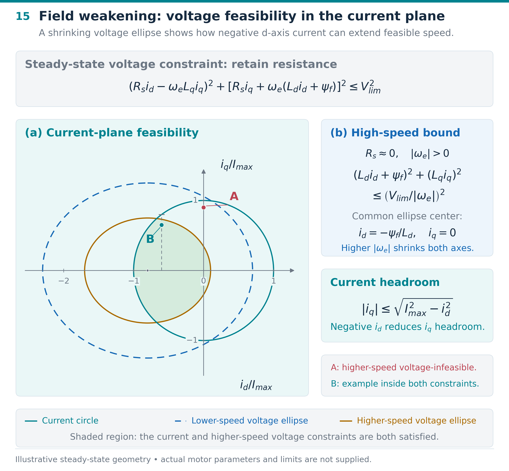

**Figure 15.** The current circle remains fixed while the voltage ellipse shrinks with electrical speed. The zero-d example A is feasible at the lower speed and voltage-infeasible at the higher speed. Negative-d/reduced-q example B lies in the higher-speed overlap. Parameters are illustrative and normalized; B demonstrates feasibility rather than equal torque or optimality. This is FW constraint geometry, not a computed MTPA locus.

Negative $`i_{d}`$ can extend the voltage-feasible speed range, subject to the current circle and the remaining machine/controller bounds. No project base speed or speed-extension value is available.

### 7.2 A voltage-feedback field-weakening loop

Use the magnitude of the **requested** dq voltage before the common limiter. Measuring only the already limited output would hide excess demand:

```math
V_{\mathrm{req}}=
\sqrt{(v_{d,\mathrm{raw}}^{\ast})^{2}+(v_{q,\mathrm{raw}}^{\ast})^{2}},\qquad
e_{V}=V_{\mathrm{FW}}-V_{\mathrm{req}},\qquad
0<V_{\mathrm{FW}}\le V_{\mathrm{lim}}
```

$`V_{\mathrm{FW}}`$ is the chosen voltage target, with margin relative to the available vector limit $`V_{\mathrm{lim}}`$. It follows available DC-link voltage when that availability changes. Use identical voltage units/scaling for $`V_{\mathrm{req}}`$ and $`V_{\mathrm{FW}}`$. Starting from the MTPA d-reference $`i_{d,0}^{\ast}`$, excess demand gives negative $`e_{V}`$ and a nonpositive correction:

```math
\begin{aligned}
\Delta i_{d,\mathrm{raw}}&=K_{p,\mathrm{FW}}e_{V}+x_{\mathrm{FW}},
&K_{p,\mathrm{FW}},K_{i,\mathrm{FW}}&>0\\
\Delta i_{d,\mathrm{FW}}&=\mathrm{clip}
(\Delta i_{d,\mathrm{raw}},\,i_{d,\min}-i_{d,0}^{\ast},\,0)\\
i_{d}^{\ast}&=i_{d,0}^{\ast}+\Delta i_{d,\mathrm{FW}}
\end{aligned}
```

The MTPA baseline must itself satisfy d/current/machine bounds; its lower correction bound is nonpositive. FW state handling tracks the actually selected correction, including changes made by the joint coordinator. One positive-gain back-calculation realization is:

```math
\dot x_{\mathrm{FW}}=K_{i,\mathrm{FW}}e_{V}+
K_{aw,\mathrm{FW}}\bigl[(i_{d}^{\ast}-i_{d,0}^{\ast})-\Delta i_{d,\mathrm{raw}}\bigr],
\qquad K_{aw,\mathrm{FW}}>0
```

During inactive FW, track zero correction so $`i_{d}^{\ast}`$ follows MTPA. As voltage margin returns, release the correction toward zero with bumpless state handling. The selected d-current returns to the MTPA baseline, which need not be zero. This feedback sign applies locally where a more-negative d-reference along the coordinated accepted-torque pair lowers required voltage.

For each selected d-reference, the coordinator recalculates q-current using the accepted torque and checks the joint bounds:

```math
\begin{aligned}
i_{q}^{\ast}&=\frac{T_{\mathrm{acc}}^{\ast}}{\frac32p[\psi_{f}+(L_{d}-L_{q})i_{d}^{\ast}]}\\
(i_{d}^{\ast})^{2}+(i_{q}^{\ast})^{2}&\le I_{\max}^{2},\qquad
v_{d,ss}^{2}+v_{q,ss}^{2}\le V_{\mathrm{FW}}^{2}
\end{aligned}
```

Here $`v_{d,\mathrm{ss}}`$ and $`v_{q,\mathrm{ss}}`$ are the resistance-retained steady-state voltages from Section 7.1. The d/machine bounds and valid nonzero torque coefficient also apply. Reduce accepted torque if the pair is infeasible, then resolve the pair. FW correction tracking and current-PI voltage-saturation handling serve distinct limits; there is no speed-PI state.

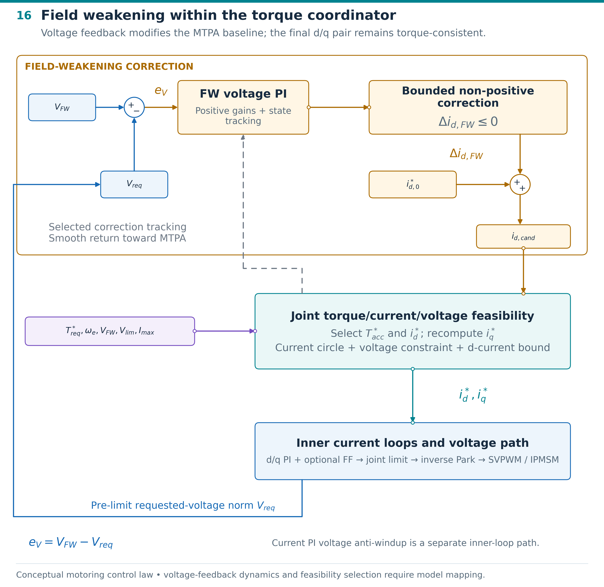

**Figure 16.** Complete requested voltage before the joint limiter drives the FW correction relative to MTPA. Selected-correction tracking handles clamping and release. Torque-consistent q recomputation and joint feasibility determine the final current pair and accepted torque.

Steady-state feasibility does not guarantee every reference transient can be produced; voltage feedback and the command limiter handle the instantaneous demand. The loop is a conceptual local realization, not a global stability proof or an MTPV optimizer. $`V_{\mathrm{FW}}`$, d-bounds, gains, and state handling remain symbolic design choices. If the joint feasible set is empty, an infeasibility/protection response is required; the project's behavior is unspecified.

### 7.3 MTPA serves a different objective

Maximum torque per ampere (MTPA) selects a current pair for a specified accepted torque $`T_{\mathrm{acc}}^{\ast}`$. In the declared linear model:

```math
(i_{d,0}^{\ast},i_{q,0}^{\ast})
=\underset{i_{d},i_{q}}{\mathrm{arg\,min}}\;(i_{d}^{2}+i_{q}^{2})
\quad\text{subject to}\quad
\frac32p\bigl[\psi_{f}i_{q}+(L_{d}-L_{q})i_{d}i_{q}\bigr]=T_{\mathrm{acc}}^{\ast}
```

For an interior solution, write Δ = $`L_{d}`$ − $`L_{q}`$. Differentiating the current norm along a constant-torque curve gives:

```math
i_{d}(\psi_{f}+\Delta i_{d})=\Delta i_{q}^{2}
```

MTPA minimizes current for accepted torque while voltage is not the active boundary, subject to applicable current/d-axis/machine bounds. If $`\psi_{f}`$ > 0 and $`L_{q}`$ > $`L_{d}`$, the motoring solution can have negative $`i_{d}`$ before FW; this motor's inductance ordering is unknown. A zero-d reference is a simplified teaching alternative, not the actual MTPA baseline. Saturating machines can require characterized parameter/reference maps instead of constant inductances.

| Strategy | Objective | Input/reference contract | d-current interpretation |
|---|---|---|---|
| MTPA baseline | Minimize current magnitude for accepted torque | $`T_{\mathrm{acc}}^{\ast}`$, motor model/maps, and machine bounds | May already be negative below FW; saliency determines the pair |
| Field weakening | Meet the voltage target as speed rises | MTPA baseline, $`V_{\mathrm{req}}`$, $`V_{\mathrm{FW}}`$, speed, and joint bounds | Adds a nonpositive correction; q is recomputed for accepted torque |
| Simplified zero-d example | Illustrate PM torque with adequate voltage headroom | Explicit torque-to-q mapping | $`i_{d}^{\ast}`$ = 0; not assumed to be IPMSM MTPA |

In the motorcycle, MTPA and FW operate within one torque-to-current coordinator. The accepted torque is explicit when constraints intervene. MTPV can be an optional high-speed extension where the feasible operating region requires it; its implementation is not confirmed here.

## 8. Interfaces and Simulink structure

### 8.1 Rotor and SVPWM interfaces

Raw mechanical position uses the confirmed five pole pairs; an already calibrated $`\theta_{e}`$ passes directly to Park and inverse Park:

```math
\theta_{e}=\mathrm{wrap}(s\,5\theta_{m}+\theta_{0}),\qquad
\omega_{e}=s\,5\omega_{m},\qquad s\in\{-1,+1\}
```

The direction, offset, and wrap convention belong to the input contract. Do not multiply an already aligned $`\theta_{e}`$ by 5 again.

| Signal | Role | Unit / meaning |
|---|---|---|
| $`i_{a}`$, $`i_{b}`$, $`i_{c}`$ | Current feedback input | A; phase currents |
| $`\theta_{e}`$ | Park and inverse Park input | Electrical rad; aligned angle |
| $`a_{\mathrm{th}}`$ | Throttle-map input | Rider command; actual electrical range/map unspecified |
| $`T_{\mathrm{req}}^{\ast}`$ | Coordinator torque demand | N·m; electrical motor-torque definition |
| $`T_{\mathrm{acc}}^{\ast}`$ | Accepted torque / limit status | N·m; model torque of the selected feasible current pair |
| $`\omega_{m}`$ | Rotor processing / operating point | Mechanical rad/s; no speed-error loop |
| $`\omega_{e}`$ | Speed-dependent model/feedforward input | Electrical rad/s |
| $`V_{\mathrm{req}}`$ | FW feedback input | V; norm of complete dq request before limitation |
| $`i_{d}^{\ast}`$, $`i_{q}^{\ast}`$ | Current-loop references | A; phase-peak dq scaling |
| $`v_{d}^{\ast}`$, $`v_{q}^{\ast}`$ | Limited internal voltage command | V; rotor-frame vector |
| $`v_{\alpha}^{\ast}`$, $`v_{\beta}^{\ast}`$ | Output to external SVPWM | Stationary-frame voltage; physical or explicitly normalized scaling |
| $`V_{\mathrm{dc}}`$, bounds | Voltage/current constraint inputs | Defined by the selected interface and reference policy |

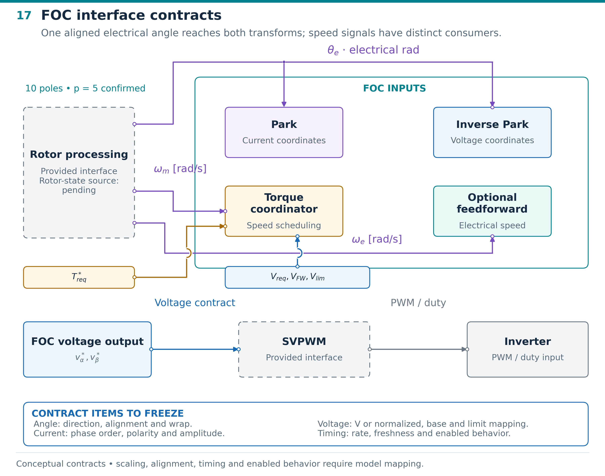

**Figure 17.** Torque demand reaches the reference coordinator. Electrical angle reaches both transforms; electrical speed feeds feasibility and optional compensation. FOC supplies stationary voltage references to external SVPWM, which supplies inverter PWM/duty commands.

### 8.2 Simulink functional structure

Using C for the amplitude-invariant Clarke matrix and P($`\theta_{e}`$) for Park, the two transform paths are:

```math
\mathbf i_{dq}=P(\theta_{e})C\mathbf i_{abc},\qquad
\mathbf v_{\alpha\beta}^{\ast}=P^{-1}(\theta_{e})\mathbf v_{dq}^{\ast}
```

The torque-to-current coordinator, PI channels, optional feedforward, common voltage limitation, and inverse Park form the forward path. Phase currents close the feedback path. Rotor processing and available DC-link voltage supply the operating-point inputs.

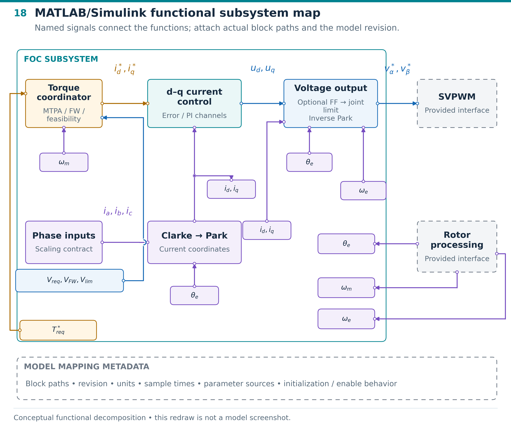

**Figure 18.** The conceptual structure groups the MTPA/FW/feasibility coordinator, current control, and voltage output. Phase currents and electrical angle feed the feedback transforms; speed and voltage bounds enter reference handling. Stationary voltage commands point outward to SVPWM.

## 9. Complete electric-motorcycle torque FOC

### 9.1 Admit torque and select a feasible current pair

The rider requests torque through the throttle, rather than a speed setpoint. The coordinator admits torque that the current/voltage/machine bounds can support. For positive motoring demand, this contract can be written symbolically:

```math
\begin{aligned}
T_{\mathrm{acc}}^{\ast}&=\max\bigl\{T:\ 0\le T\le T_{\mathrm{req}}^{\ast},\
\exists(i_{d},i_{q})\in\mathcal F,\ T_{e}(i_{d},i_{q})=T\bigr\}\\
\mathcal F&=\bigl\{(i_{d},i_{q}):\ i_{d}^{2}+i_{q}^{2}\le I_{\max}^{2},\
v_{d,ss}^{2}+v_{q,ss}^{2}\le V_{\mathrm{FW}}^{2},\
i_{d,\min}\le i_{d}\le i_{d,\max},\ \text{machine bounds}\bigr\}
\end{aligned}
```

F depends on electrical speed and available voltage. MTPA supplies the inactive-FW baseline; the nonpositive FW correction changes d-current when voltage becomes restrictive. q-current is recalculated from selected d-current and accepted torque. A calibrated lookup or validated constrained allocation can implement this contract; no particular embedded solver is assumed. Regenerative torque admission needs separate battery/vehicle policies, which are not supplied.

### 9.2 Close the current paths and handle voltage saturation

The complete raw dq request is tapped for $`V_{\mathrm{req}}`$ before limitation. A common direction-preserving vector limiter is one illustrative realization:

```math
\begin{aligned}
\gamma&=\begin{cases}
1,&\|\mathbf v_{dq,\mathrm{raw}}^{\ast}\|=0\\
\min\bigl(1,V_{\mathrm{lim}}/\|\mathbf v_{dq,\mathrm{raw}}^{\ast}\|\bigr),&\text{otherwise}
\end{cases}\\
\mathbf v_{dq}^{\ast}&=\gamma\mathbf v_{dq,\mathrm{raw}}^{\ast}
\end{aligned}
```

The limited-minus-raw voltage residual returns to the matching PI states. For positive back-calculation gains:

```math
\begin{aligned}
\dot x_{d}&=K_{id}e_{d}+K_{aw,d}(v_{d}^{\ast}-v_{d,\mathrm{raw}}^{\ast})\\
\dot x_{q}&=K_{iq}e_{q}+K_{aw,q}(v_{q}^{\ast}-v_{q,\mathrm{raw}}^{\ast}),\qquad
K_{aw,d},K_{aw,q}>0
\end{aligned}
```

FW state tracking uses its selected current correction, while these current PI states track voltage saturation. Three acquired phase currents return through Clarke/Park to the matching negative d/q error inputs. Electrical angle reaches Park and inverse Park; electrical speed reaches feasibility and optional feedforward. Measured DC-link voltage supplies available-voltage limits. The actuator path continues through inverse Park, external SVPWM, inverter, motor, and drivetrain/load.


**Figure 19.** Complete throttle-to-torque FOC for the electric motorcycle. The coordinator combines MTPA, voltage-feedback FW, and joint feasibility, supplying both current references. The pre-limiter voltage norm feeds FW; the voltage residual feeds the matching current PI anti-windup channels. Current and rotor feedback close the corresponding paths. $`T_{\mathrm{acc}}^{\ast}`$ is accepted model torque/limit status, not a measured-torque feedback loop. There is no speed PI, and inactive/released FW returns to MTPA rather than forcing $`i_{d}^{\ast}`$ = 0.

## Mathematical references

- [Clarke Transform — amplitude-invariant equations](https://www.mathworks.com/help/mcb/ref/clarketransform.html)
- [Park Transform — axis alignment and transformation matrix](https://www.mathworks.com/help/mcb/ref/parktransform.html)
- [PMSM HDL — amplitude-invariant motor equations](https://www.mathworks.com/help/mcb/ref/pmsmhdl.html)
- [PMSM FeedForward Control — compensation signs](https://www.mathworks.com/help/mcb/ref/pmsmfeedforwardcontrol.html)
- [PMSM Current Controller — PI control and voltage limitation](https://www.mathworks.com/help/simscape-electrical/ref/pmsmcurrentcontroller.html)
- [Field-Weakening Control with MTPA — operating constraints and reference strategies](https://www.mathworks.com/help/mcb/gs/field-weakening-control-mtpa-pmsm.html)
- [MTPA Control Reference — torque demand and current/voltage constraints](https://www.mathworks.com/help/mcb/ref/mtpacontrolreference.html)
- [Interior PM Controller — torque control and coordinated current references](https://www.mathworks.com/help/autoblks/ref/interiorpmcontroller.html)
- [TI SPRACF3 — voltage-feedback field weakening and MTPA reference contracts](https://www.ti.com/lit/an/spracf3/spracf3.pdf)
